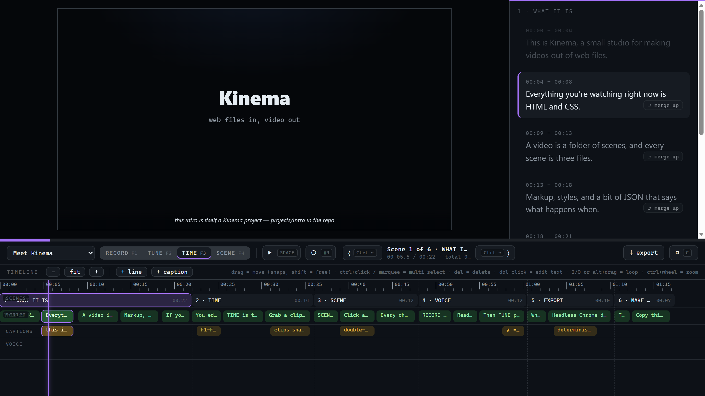

# Kinema

A local studio for data-driven animation videos. Play and scrub HTML/CSS scenes
on one global timeline, drag clips to tune every timing, read narration off a
synced teleprompter, record per-scene voice takes, and export a frame-exact MP4
with the takes muxed in.

The studio is strictly separated from the content. A video is a **project**: a
folder of scenes, where each scene is plain HTML + CSS + a JSON file of timings
and narration. The files on disk are the whole video, so a human or an AI can
edit one scene without touching anything else.



## Quickstart

Requires Node.js and an installed Chrome or Edge (for export).

1. `npm install`
2. `npm run dev`
3. Open http://localhost:4321/ and pick the **Meet Kinema** project.

That intro project is a short tour of the tool. The keys and interactions live in
the UI hint bar and button tooltips, so just start playing and dragging.

## Docs

- [docs/workflow.md](docs/workflow.md) — the happy path: draft with AI, tune
  timings, record voice, export MP4, and how to pick or add a project.
- [docs/project-format.md](docs/project-format.md) — the file format: folders,
  `project.json`, `scene.json`, schedule semantics, theme helpers.
- [docs/project-repos.md](docs/project-repos.md) — how projects relate to git:
  why your videos aren't in the studio repo, and the recommended own-repo setup.

## Develop

```
npm run typecheck
npm run validate            # validate the default project's scene files
node scripts/smoke.mjs      # boot the studio + render mode in headless Chrome (dev server up)
```
